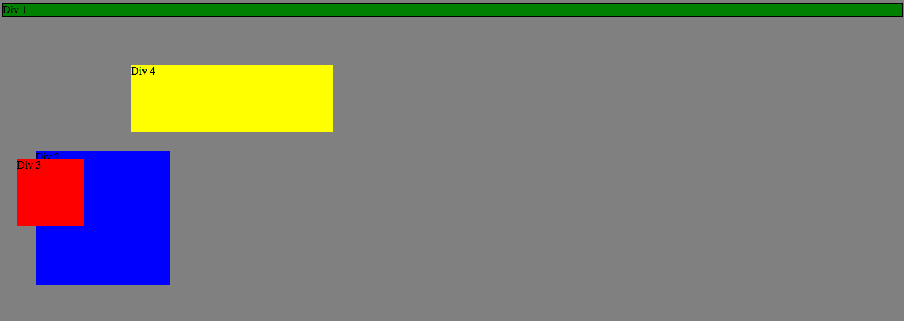
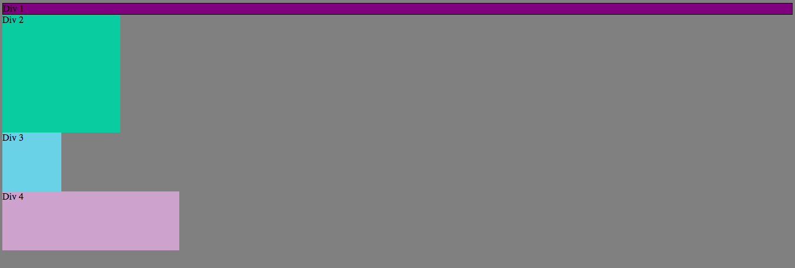
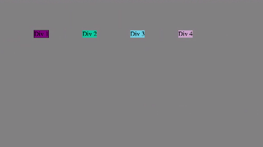
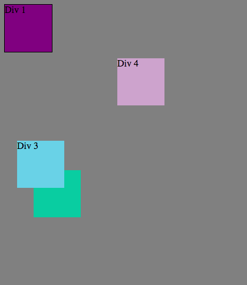
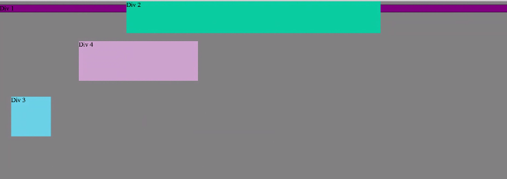
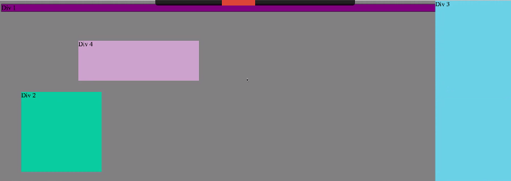
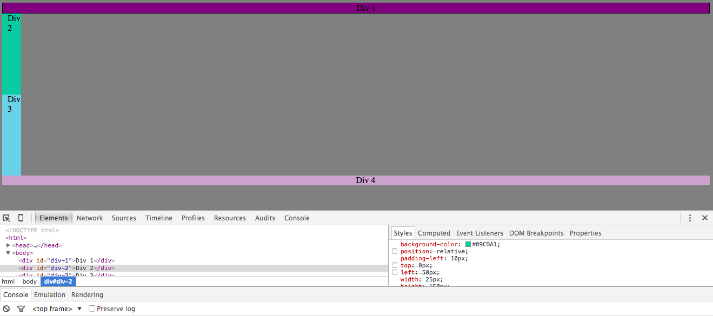

#1:

#2:

#3:

#4:

#5:

#6:

#7:

#8:

#9: 

#How can you use Chrome's DevTools inspector to help you format or position elements?

You see instantly how certain changes or elements affect the page without needing to open up a lot of files and save and reopen anything.

#How can you resize elements on the DOM using CSS?

Just find the element you want to resize and pinpoint to where on the CSS html file it is affecting and change the height and width. 

#What are the differences between absolute, fixed, static, and relative positioning? Which did you find easiest to use? Which was most difficult?

Absolute - the element is positioned relative to the first positioned element. 
Fixed - the element is positioned according to the browser window
Static - the element is positioned in order, as they appear in the doc flow
Relative - the element is positioned relative to its normal position

The easiest to use is fixed because the browser window is clearly one size and I naturally want to place objects relative to the window rather than to other objects. The most difficult one to understand was the absolute, because it's not totally clear what the element is being referred to and it sometimes has the same resulting positions at having the position set as fixed. 

#What are the differences between margin, border, and padding?

Padding - Transparant area around the content 
Border - the part that goes around the padding and content 
margin - is the place outside the border, also transparent 

The way I identify the different is I visualize the padding as that blank that goes around the words I type, as it is in this sentence. Clearly, none of my letter are touching the letters in the previous sentence because there is some kind of padding. And the border if it were visible would be outlining the padding. The margin is outside the border and creates space between my content/padding and the rest of the document. 

#What was your impression of this challenge overall? (love, hate, and why?)

This challnege was a lot of fun. I did have a bit of challenge with #7 because my partner and I were convinced that we had to use auto within our code, but after consulting with my team leader, our method was perfectly fine and auto was not the best use case for this exercise. 

