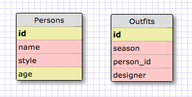

#SQL SOLUTIONS
----------------------
SELECT * FROM states;
SELECT * FROM regions;
SELECT state_name, population FROM states;
SELECT state_name, population FROM states ORDER BY population DESC;
SELECT state_name FROM states WHERE region_id='7';
SELECT state_name, population_density FROM states WHERE population_density > 50;
SELECT state_name FROM states WHERE population BETWEEN 1000000 AND 1500000;
SELECT state_name, region_id FROM states ORDER BY region_id ASC;
SELECT * FROM regions WHERE region_name LIKE '%Central%';
SELECT region_name, state_name from regions JOIN states ON region_id ORDER BY region_id ASC;

#Reflection
---------------------
What are databases for?
Databases are computer software designed to handle lots quantities of data, and meant to be easy to store and find specific snippets of data. 
What is a one-to-many relationship?
One-to-many relationship is one of three types of relationships you can have in SQL (one to one, one to many, many to many). It's used if there is a need for one piece of data to be associated with many data relationships, such as one employer to many employees. 

What is a primary key? What is a foreign key? How can you determine which is which?
A primary key is a column in a table that uniquely identifies each record in a database table. They must contain unique values and cannot contain null values. Foreign keys are keys in an outside table that points to a primary key in another table. You can determine which is which by reading the column title and seeing if there are any duplicates. 

How can you select information out of a SQL database? What are some general guidelines for that? You can select information out of a SQL database by using SQL. Some general guidelines is that there are specific commands you can use to describe what you want out of the databse. 