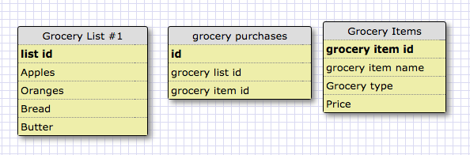
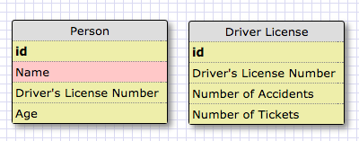

#Screenshots:

   
 

#Reflection
-------------------
What is a one-to-one database?  
One to one database is a type of database relation where one data item is associated with one data. 

When would you use a one-to-one database? (Think generally, not in terms of the example you created).
A one-to-one database would be used when there is only one possible relation and none at all.

What is a many-to-many database?
Many to many database is a relation between many pieces of data that can be associate to many other pices of data. 

When would you use a many-to-many database? (Think generally, not in terms of the example you created).
You would use it when there are many possible links between data. 

What is confusing about database schemas? What makes sense?
What's confusing is figuring out how many tables will be needed to represent a dataset. What makese sense is how to orgaize data within a table. 